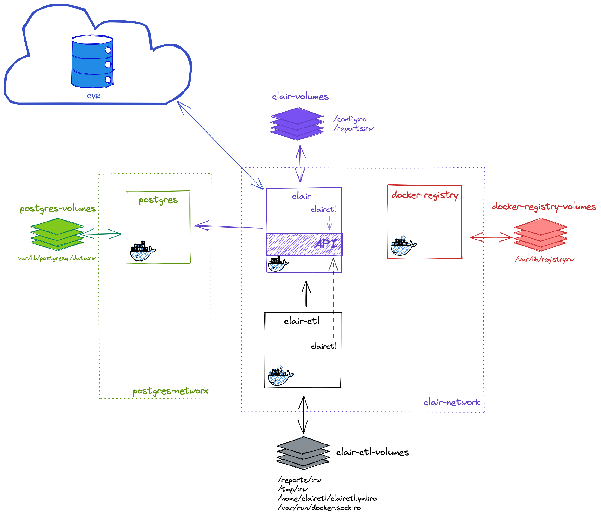

# clair-test

## TOC

* Arquitectura
* Clair Network
* Docker Registry
* Postgres
* Clairctl
* Clair 4.2.0
* Clair 2.1.7
* Análisis Clair 4.2.0
  * Clairctl oficial
    * Análisis remoto
      * vulnerables/web-dvwa
      * jgsqware/clairctl
    * Análisis local
  * `clairctl`
    * Análisis remoto
    * Análisis local
* Análisis Clair 2.1.7
  * Clairctl oficial
  * `clairctl`
    * Análisis remoto
      * vulnerables/web-dvwa
      * jgsqware/clairctl
    * Análisis local
* ERRORES
  * Clair 4.20
    * `clairctl`
      * Análisis local

## Arquitectura

## clair network

Creamos la red para Clair y aquellos contenedores que necesitan conexión con Clair como vimos en el diagrama anterior.

    docker network create clair-network

## docker registry (2.7.1)
<!-- sha256:42043edfae481178f07aa077fa872fcc242e276d302f4ac2026d9d2eb65b955f -->

Creamos el registro de imágenes docker para los análisis locales con el cliente `clairctl oficial`

    docker volume create registry-volume

    docker container run \
    --detach \
    --name registry \
    --network clair-network \
    --rm \
    --entrypoint /entrypoint.sh \
    --volume registry-volume:/var/lib/registry:rw \
    registry:2.7.1 \
    /etc/docker/registry/config.yml

## postgres (alpine3.14)
<!-- sha256:c72d0da357ccbe11f769b3b4319ec3281014447d1b6dd9f636cf9dfffe9ed258 -->

Creamos el volumen para el almacenamiento de la base de datos y la red del contenedor. Después levantanmos el contenedor y lo añadimos también a la red `clair-network`

    docker volume create postgres-volume

    docker container run \
    --detach \
    --name postgres \
    --network clair-network \
    --rm \
    --entrypoint docker-entrypoint.sh \
    --volume postgres-volume:/var/lib/postgresql/data:rw \
    --env POSTGRES_DB=clair \
    --env POSTGRES_USER=clair \
    --env POSTGRES_PASSWORD=clair \
    postgres:alpine3.14 \
    postgres

## postgres (9.6.23)
<!-- sha256:0c544a9de02082855b4ee592d59685403a8b51acdcd559cef4140ad9ef1396bd -->

Creamos el volumen para el almacenamiento de la base de datos y la red del contenedor. Después levantanmos el contenedor y lo añadimos también a la red `clair-network`

    docker volume create postgres-volume

    docker container run \
    --detach \
    --name postgres \
    --network clair-network \
    --rm \
    --entrypoint docker-entrypoint.sh \
    --volume postgres-volume:/var/lib/postgresql/data:rw \
    --env POSTGRES_DB=clair \
    --env POSTGRES_USER=clair \
    --env POSTGRES_PASSWORD=clair \
    postgres:9.6.23 \
    postgres

## clairctl (master)
<!-- sha256:663236e4373c4857e20d4e568eff3280657b9b97648b4e510484d4ee4ff64bef -->

Este es el cliente de Clair no oficial. Se ejecuta desde un contenedor. El [proyecto](https://github.com/jgsqware/clairctl) está descontinuado desde el 2018.

Levantamos el contenedor con la última imagen disponible y lo conectamos a la red `clair-network`

    docker container run \
    --detach \
    --name clairctl \
    --network clair-network \
    --rm \
    --volume ${PWD}/clairctl/reports/:/reports/:rw \
    --volume /tmp:/tmp:rw \
    --volume ${PWD}/clairctl/clairctl.yml:/home/clairctl/clairctl.yml \
    --volume /var/run/docker.sock:/var/run/docker.sock:ro \
    --workdir /home/clairctl/ \
    --user root \
    jgsqware/clairctl:master

## clair (4.2.0)

Este el corazón del proceso, expone el API sonbre el que se lanzarán las consultas por parte de los clientes. También actualizará la base de datos con las vulnerablidades descargadas de los repositorios de vulnerabilidades oficiales.

Este contenedor también dispone de un cliente de Clair que llamaremos `clairctl oficial`

    docker container run \
    --detach \
    --name clair \
    --network clair-network \
    --rm \
    --entrypoint /usr/local/bin/dumb-init \
    --volume ${PWD}/clair/config:/config:ro \
    --volume ${PWD}/clair/reports:/reports:rw \
    --workdir /run \
    quay.io/projectquay/clair:4.2.0@sha256:917df97fd182bf45d880649285b45e730a52e6cca4b70e3b0a810d4e39d43c9a \
    -- /bin/clair

## Clair (v2.1.7)
<!-- sha256:0962dd91c2f5de60ea2c0019fb275bc463fce6f59db96597e09e645627439909 --> 

    docker container run \
    --detach \
    --name clair \
    --rm \
    --network clair-network \
    --volume ${PWD}/clair/config/config_v2.1.7.yaml:/etc/clair/config.yaml:ro \
    --volume ${PWD}/clair/reports:/reports:rw \
    --workdir /go/clair/ \
    --entrypoint /usr/bin/dumb-init \
    quay.io/coreos/clair:v2.1.7 \
    -- /clair

## Análisis Clair 4.2.0

### Análisis con `clairctl oficial`

#### Análisis de imágenes remotas

##### vulnerables/web-dvwa

    docker exec clair clairctl report -o json vulnerables/web-dvwa | jq > clair/reports/clair_remote.json
  
  Extracción de los códigos de vulnerabilidad

    docker exec clair clairctl report \
    -o json \
    vulnerables/web-dvwa:latest@sha256:dae203fe11646a86937bf04db0079adef295f426da68a92b40e3b181f337daa7 \
    | jq '.vulnerabilities[].name' > clair/reports/clair_remote_cves.txt

##### jgsqware/clairctl:master

TODO: Hacer análisis remoto para jgsqware/clairctl

#### Análisis local

TODO: realizar análisis local usando el docker registry

### Análisis con `clairctl`

#### Análisis remoto

TODO: realizar análisis remoto

#### Análisis local

    clairctl analyze -l jgsqware/clairctl:master --log-level Debug

## Análisis Clair 2.1.7

### Comandos de scan `clairctl oficial`

Clair no dispone de un `clairctl oficial` y en su lugar te redirige al cliente ubicado en el proyecto [jgsqware/clairctl](https://github.com/jgsqware/clairctl)

debes logar primero el dockerhub

    docker login

### Comandos de scan `clairctl`

#### Análisis remoto

if you want to analyze official images, you need to issue the docker login command.

##### vulnerables/web-dvwa

Comando para análisis (una vez ha cargado la base de datos)

    docker exec clairctl clairctl analyze vulnerables/web-dvwa --log-level Debug

Resultado:

    Image: docker.io/vulnerables/web-dvwa:latest
 
    Unknown: 0
    Negligible: 8
    Low: 1
    Medium: 7
    High: 3
    Critical: 0
    Defcon1: 0

Comando para reporte

    docker exec clairctl clairctl report vulnerables/web-dvwa --log-level Debug

[analysis-vulnerables-web-dvwa-latest.html](.clairctl/reports/html/analysis-vulnerables-web-dvwa-latest.html)

##### jgsqware/clairctl:master

Comando para análisis:

    docker exec clairctl clairctl analyze jgsqware/clairctl:master --log-level Debug

Resultado:

    Unknown: 0
    Negligible: 0
    Low: 0
    Medium: 4
    High: 5
    Critical: 1
    Defcon1: 0

Comando para reporte:

    docker exec clairctl clairctl report jgsqware/clairctl:master --log-level Debug

[analysis-jgsqware-clairctl-master.html](./clairctl/reports/html/analysis-jgsqware-clairctl-master.html)

#### Análisis local

##### vulnerables/web-dvwa (v)

Comando para análisis local:

    docker exec clairctl clairctl analyze -l vulnerables/web-dvwa --log-level Debug

Resultado:
    
     Unknown: 5
     Negligible: 100
     Low: 105
     Medium: 218
     High: 49
     Critical: 4
     Defcon1: 0

Comando para reporte:

    docker exec clairctl clairctl report -l vulnerables/web-dvwa --log-level Debug

Resultado:

[analysis-vulnerables-web-dvwa-latest-local.html](clairctl/reports/html/analysis-vulnerables-web-dvwa-latest-local.html)

##### jgsqware/clairctl:master (V)

Comando para análisis local:

    docker exec clairctl clairctl analyze -l jgsqware/clairctl:master --log-level Debug
    
Resultado:
    
     Unknown: 0
     Negligible: 0
     Low: 0
     Medium: 4
     High: 5
     Critical: 1
     Defcon1: 0

Comando para reporte:

    docker exec clairctl clairctl report -l jgsqware/clairctl:master --log-level Debug

Resultado:

[analysis-jgsqware-clairctl-master-local.html](clairctl/reports/html/analysis-jgsqware-clairctl-master-local.html)

## Recopilación de errores

### Clair 4.20

#### `clairctl`

##### Análisis local

* Sin DinD
    
        2021-08-13 20:40:32.022269 D | config: Using config file: /home/clairctl/clairctl.yml2021-08-13 20:40:32.024382 D | dockercli: docker image to save: jgsqware/clairctl:master
        2021-08-13 20:40:32.024940 D | dockercli: saving in: /tmp/jgsqware/clairctl/blobs
        client quit unexpectedly
        2021-08-13 20:40:32.026821 C | cmd: retrieving manifest for "jgsqware/clairctl:master": cannot save image jgsqware/clairctl:master: Cannot connect to the Docker daemon at unix:///var/run/docker.sock. Is the docker daemon running?

* Con DinD y Sin usuario root:

      2021-08-13 20:38:00.969660 D | config: Using config file: /home/clairctl/clairctl.yml
      2021-08-13 20:38:00.971723 D | dockercli: docker image to save: jgsqware/clairctl:master
      2021-08-13 20:38:00.971790 D | dockercli: saving in: /tmp/jgsqware/clairctl/blobs
      client quit unexpectedly
      2021-08-13 20:38:00.972641 C | cmd: retrieving manifest for "jgsqware/clairctl:master": cannot save image jgsqware/clairctl:master: Got       permission denied while trying to connect to the Docker daemon socket at unix:///var/run/docker.sock: Get http://%2Fvar%2Frun%2Fdocker.sock/      v1.24/images/get?names=jgsqware%2Fclairctl%3Amaster: dial unix /var/run/docker.sock: connect: permission denied

* Con DinD y usuario root

        2021-08-13 20:42:27.988437 D | config: Using config file: /home/clairctl/clairctl.yml2021-08-13 20:42:27.991659 D | dockercli: docker image to save: jgsqware/clairctl:master
        2021-08-13 20:42:27.991956 D | dockercli: saving in: /tmp/jgsqware/clairctl/blobs
        2021-08-13 20:44:02.003124 I | config: retrieving interface for local IP
        2021-08-13 20:44:02.003146 D | config: no interface provided, looking for docker0
        2021-08-13 20:44:02.003270 D | config: docker0 not found, looking for first connected broadcast interface
        2021-08-13 20:44:02.003991 I | server: Starting Server on 172.19.0.5:44480
        2021-08-13 20:44:02.009143 I | config: retrieving interface for local IP
        2021-08-13 20:44:02.009208 D | config: no interface provided, looking for docker0
        2021-08-13 20:44:02.009972 D | config: docker0 not found, looking for first connected broadcast interface
        2021-08-13 20:44:02.010219 I | clair: using http://172.19.0.5:44480/local as local url
        2021-08-13 20:44:02.010246 I | clair: Pushing Layer 1/2 [d186ba14877c]
        2021-08-13 20:44:02.010345 D | clair: Saving d186ba14877c7464fbbcb26a9847f0c916c5f81ad2172fed104c3f5c5f0c06e7[https://registry-1.docker.io/v2]
        2021-08-13 20:44:02.014955 I | clair: adding layer 1/2 [d186ba14877c]: receiving http error: 404
        client quit unexpectedly
        2021-08-13 20:44:02.015024 C | cmd: pushing image "jgsqware/clairctl:master": receiving http error: 404

* mismo error con el comando 

        docker exec clairctl clairctl push -l jgsqware/clairctl:master --log-level Debug
  
  lo que hace sospechar que el problema está en el push de la image.

        2021-08-13 20:45:43.393222 D | config: Using config file: /home/clairctl/clairctl.yml
        2021-08-13 20:45:43.393625 I | config: retrieving interface for local IP
        2021-08-13 20:45:43.393936 D | config: no interface provided, looking for docker0
        2021-08-13 20:45:43.395072 D | config: docker0 not found, looking for first connected broadcast interface
        2021-08-13 20:45:43.396387 I | server: Starting Server on 172.19.0.5:44480
        2021-08-13 20:45:43.404133 D | dockercli: docker image to save: jgsqware/clairctl:master
        2021-08-13 20:45:43.404747 D | dockercli: saving in: /tmp/jgsqware/clairctl/blobs
        2021-08-13 20:47:15.712315 I | config: retrieving interface for local IP
        2021-08-13 20:47:15.712342 D | config: no interface provided, looking for docker0
        2021-08-13 20:47:15.712483 D | config: docker0 not found, looking for first connected broadcast interface
        2021-08-13 20:47:15.712916 I | clair: using http://172.19.0.5:44480/local as local url
        2021-08-13 20:47:15.712943 I | clair: Pushing Layer 1/2 [d186ba14877c]
        2021-08-13 20:47:15.713038 D | clair: Saving d186ba14877c7464fbbcb26a9847f0c916c5f81ad2172fed104c3f5c5f0c06e7[https://registry-1.docker.io/v2]
        2021-08-13 20:47:15.726001 I | clair: adding layer 1/2 [d186ba14877c]: receiving http error: 404
        client quit unexpectedly
        2021-08-13 20:47:15.726099 C | cmd: pushing image "jgsqware/clairctl:master": receiving http error: 404

## Otros proyectos a revisar

### Klar

Otro cliente de Clair pensado para CICD:

https://github.com/optiopay/klar

### Reg

Analiza las imágenes (entre otras cosas) de un registro:

https://github.com/genuinetools/reg#vulnerability-reports
