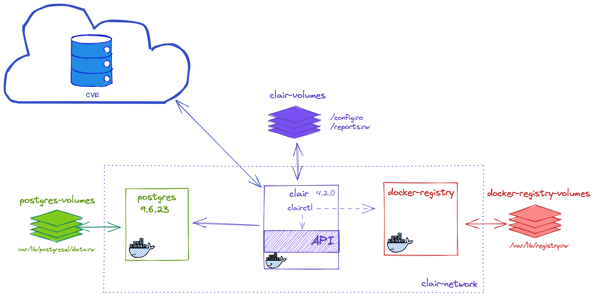
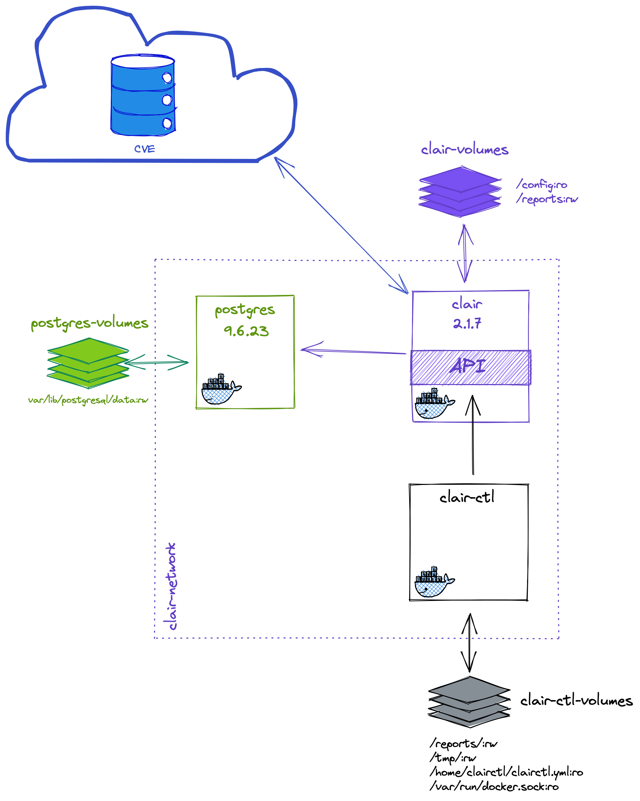

# clair-test

## TOC

* Arquitectura
  * 4.2.0
  * 2.1.7
* Instalación
  * Clair Network
  * Docker Registry
  * Postgres
  * Clairctl
  * Clair 4.2.0
    * Traza de finalización
  * Clair 2.1.7
    * Traza de finalización de carga de updaters
* Análisis
  * Clair 4.2.0
    * Análisis remoto `clairctl oficial`
      * vulnerables/web-dvwa
      * jgsqware/clairctl
      * alpine:3.14
    * Análisis local `clairctl oficial`
      * vulnerables/web-dvwa
      * jgsqware/clairctl
      * alpine:3.14
    * Análisis remoto `clairctl`
    * Análisis local `clairctl`
  * Clair 2.1.7
    * Análisis remoto `clairctl`
      * vulnerables/web-dvwa
      * jgsqware/clairctl
      * alpine:3.14
    * Análisis local `clairctl`
      * vulnerables/web-dvwa
      * jgsqware/clairctl
      * alpine:3.14
* Recopilación de errores
  * Clair 4.2.0
    * `clairctl`
      * Análisis local
  * Clair 2.1.7
* Otros proyectos a revisar
* Limpieza del entorno

## Arquitectura

### 4.2.0

### 2.1.7

## Instalación

### clair network

Creamos la red para Clair y aquellos contenedores que necesitan conexión con Clair como vimos en el diagrama anterior.

    docker network create clair-network

### docker registry (2.7.1)
<!-- sha256:42043edfae481178f07aa077fa872fcc242e276d302f4ac2026d9d2eb65b955f -->

Creamos el registro de imágenes docker para los análisis locales con el cliente `clairctl oficial`. Creamos un volumen de almacenamiento y lo conectamos a la red `clair-network`:

    docker volume create registry-volume

    docker container run \
    --detach \
    --entrypoint /entrypoint.sh \
    --name registry \
    --network clair-network \
    -p 5000:5000 \
    --rm \
    --volume registry-volume:/var/lib/registry:rw \
    registry:2.7.1 \
    /etc/docker/registry/config.yml

<!-- 
## postgres (alpine3.14) 
-->
<!-- sha256:c72d0da357ccbe11f769b3b4319ec3281014447d1b6dd9f636cf9dfffe9ed258 -->

<!--
Levantanmos el contenedor y lo añadimos también a la red `clair-network`

    docker volume create postgres-volume

    docker container run \
    --detach \
    --entrypoint docker-entrypoint.sh \
    --env POSTGRES_DB=clair \
    --env POSTGRES_PASSWORD=clair \
    --env POSTGRES_USER=clair \
    --name postgres \
    --network clair-network \
    --rm \
    --volume postgres-volume:/var/lib/postgresql/data:rw \
    postgres:alpine3.14 \
    postgres
-->

### postgres (9.6.23)
<!-- sha256:0c544a9de02082855b4ee592d59685403a8b51acdcd559cef4140ad9ef1396bd -->

Levantanmos el contenedor y lo añadimos también a la red `clair-network`

    docker volume create postgres-volume

    docker container run \
    --detach \
    --entrypoint docker-entrypoint.sh \
    --env POSTGRES_DB=clair \
    --env POSTGRES_PASSWORD=clair \
    --env POSTGRES_USER=clair \
    --name postgres \
    --network clair-network \
    --rm \
    --volume postgres-volume:/var/lib/postgresql/data:rw \
    postgres:9.6.23 \
    postgres

### clairctl (master)
<!-- sha256:663236e4373c4857e20d4e568eff3280657b9b97648b4e510484d4ee4ff64bef -->

Este es el cliente de Clair no oficial. Se ejecuta desde un contenedor. El [proyecto](https://github.com/jgsqware/clairctl) está descontinuado desde el 2018.

Levantamos el contenedor con la última imagen disponible y lo conectamos a la red `clair-network`

    docker container run \
    --detach \
    --name clairctl \
    --network clair-network \
    --rm \
    --user root \
    --volume ${PWD}/clairctl/reports/:/reports/:rw \
    --volume /tmp:/tmp:rw \
    --volume ${PWD}/clairctl/clairctl.yml:/home/clairctl/clairctl.yml \
    --volume /var/run/docker.sock:/var/run/docker.sock:ro \
    --workdir /home/clairctl/ \
    jgsqware/clairctl:master

### clair (4.2.0)
<!-- sha256:917df97fd182bf45d880649285b45e730a52e6cca4b70e3b0a810d4e39d43c9a -->

Este el corazón del proceso, expone el API sonbre el que se lanzarán las consultas por parte de los clientes. También actualizará la base de datos con las vulnerablidades descargadas de los repositorios de vulnerabilidades oficiales.

Este contenedor también dispone de un cliente de Clair que llamaremos `clairctl oficial`

    docker container run \
    --detach \
    --entrypoint /usr/local/bin/dumb-init \
    --name clair \
    --network clair-network \
    --rm \
    --volume ${PWD}/clair/config/config_v4.2.0.yaml:/config/config.yaml:ro \
    --volume ${PWD}/clair/reports:/reports:rw \
    --workdir /run \
    quay.io/projectquay/clair:4.2.0 \
    -- /bin/clair

#### Traza de finalización

De arranque de la aplicación:

    {"level":"info","component":"main","version":"v4.2.0","time":"2021-08-15T16:31:11Z","message":"ready"}

De carga de updaters

    ?¿?¿?¿?¿?¿?¿?¿?¿?¿?¿

### Clair (v2.1.7)
<!-- sha256:0962dd91c2f5de60ea2c0019fb275bc463fce6f59db96597e09e645627439909 --> 

    docker container run \
    --detach \
    --entrypoint /usr/bin/dumb-init \
    --name clair \
    --rm \
    --network clair-network \
    --volume ${PWD}/clair/config/config_v2.1.7.yaml:/etc/clair/config.yaml:ro \
    --volume ${PWD}/clair/reports:/reports:rw \
    --workdir /go/clair/ \
    quay.io/coreos/clair:v2.1.7 \
    -- /clair

#### Traza de finalización de carga de updaters

    {"Event":"finished fetching","Level":"info","Location":"updater.go:253","Time":"2021-08-15 07:49:34.272604","updater name":"rhel"}
    {"Event":"finished fetching","Level":"info","Location":"updater.go:253","Time":"2021-08-15 07:49:34.884695","updater name":"oracle"}
    {"Event":"finished fetching","Level":"info","Location":"updater.go:253","Time":"2021-08-15 07:49:36.562141","updater name":"amzn2"}
    {"Event":"finished fetching","Level":"info","Location":"updater.go:253","Time":"2021-08-15 07:49:37.102230","updater name":"alpine"}
    {"Event":"finished fetching","Level":"info","Location":"updater.go:253","Time":"2021-08-15 07:49:37.349593","updater name":"amzn1"}

## Análisis

### Clair 4.2.0

#### Análisis remoto con `clairctl oficial`

* vulnerables/web-dvwa

      docker exec clair clairctl report -o json vulnerables/web-dvwa | jq > clair/reports/vulnerables_web-dvwa_latest_remote.json
  
  Extracción de los códigos de vulnerabilidad

      docker exec clair clairctl report \
      -o json \
      vulnerables/web-dvwa:latest \
      | jq '.vulnerabilities[].name' > clair/reports/vulnerables_web-dvwa_latest_remote_cves.txt

* jgsqware/clairctl:master

      docker exec clair clairctl report -o json jgsqware/clairctl:master | jq > clair/reports/jgsqware_clairctl_master_remote.json

    Extracción de los códigos de vulnerabilidad

      docker exec clair clairctl report \
      -o json \
      jgsqware/clairctl:master \
      | jq '.vulnerabilities[].name' > clair/reports/jgsqware_clairctl_master_remote_cves.txt

* alpine:3.14

      docker exec clair clairctl report -o json alpine:3.14 | jq > clair/reports/alpine_3.14_remote.json

    Extracción de los códigos de vulnerabilidad

      docker exec clair clairctl report \
      -o json \
      alpine:3.14 \
      | jq '.vulnerabilities[].name' > clair/reports/alpine_3.14_remote_cves.txt

#### Análisis local con `clairctl oficial`

Lo primero es añadir el docker registry 'registry' al /etc/hosts como localhost

    echo "127.0.0.1 registry" | sudo tee -a /etc/hosts

* vulnerables/web-dvwa

  Renombrar la images para que suba al resitro local:

      docker tag vulnerables/web-dvwa registry:5000/vulnerables/web-dvwa:latest

  Subir la imagen al registro:

      docker push registry:5000/vulnerables/web-dvwa:latest

  Y ejecutar el análisis indicando el registry al que se ha subido la imagen:

      docker exec clair clairctl -D report registry:5000/vulnerables/web-dvwa:latest

  Resultado:

TODO: resolver el error del registro y continuar con el análisis de las demás imágenes.

* jgsqware/clairctl:master
* alpine:3.14

#### Análisis remoto con `clairctl`

__No es compatible con el API de Clair 4.2.0__

#### Análisis local con `clairctl`

__No es compatible con el API de Clair 4.2.0__

### Clair 2.1.7

#### Análisis remoto con `clairctl oficial`

Clair no dispone de un `clairctl oficial` y en su lugar te redirige al cliente ubicado en el proyecto [jgsqware/clairctl](https://github.com/jgsqware/clairctl)

#### Análisis local con `clairctl oficial`

Clair no dispone de un `clairctl oficial` y en su lugar te redirige al cliente ubicado en el proyecto [jgsqware/clairctl](https://github.com/jgsqware/clairctl)

#### Análisis remoto con `clairctl`

Debes logar primero el registro de imágenes si vas a analizar imágenes oficiales. El login debe hacerse dentro del contenedor por lo que se puede ejecutar este comando (previa sustitución de las variables)

    docker exec -it clairctl docker login -u ${username} -p ${password | token}

* vulnerables/web-dvwa

  Comando para análisis (una vez ha cargado la base de datos)
  
      docker exec clairctl clairctl analyze vulnerables/web-dvwa --log-level Debug
  
  Resultado:
  
      Image: docker.io/vulnerables/web-dvwa:latest
   
      Unknown: 0
      Negligible: 8
      Low: 1
      Medium: 7
      High: 3
      Critical: 0
      Defcon1: 0
  
  Comando para reporte
  
      docker exec clairctl clairctl report vulnerables/web-dvwa --log-level Debug
  
  [analysis-vulnerables-web-dvwa-latest.html](.clairctl/reports/html/  analysis-vulnerables-web-dvwa-latest-remoto.html)

* jgsqware/clairctl:master

  Comando para análisis:
  
      docker exec clairctl clairctl analyze jgsqware/clairctl:master --log-level Debug
  
  Resultado:
  
      Unknown: 0
      Negligible: 0
      Low: 0
      Medium: 4
      High: 5
      Critical: 1
      Defcon1: 0
  
  Comando para reporte:
  
      docker exec clairctl clairctl report jgsqware/clairctl:master --log-level Debug
  
  [analysis-jgsqware-clairctl-master.html](./clairctl/reports/html/analysis-jgsqware-clairctl-master-remoto.html)

#### Análisis local con `clairctl`

* vulnerables/web-dvwa (v)

  Comando para análisis local:
  
      docker exec clairctl clairctl analyze -l vulnerables/web-dvwa --log-level Debug
  
  Resultado:
      
       Unknown: 5
       Negligible: 100
       Low: 105
       Medium: 218
       High: 49
       Critical: 4
       Defcon1: 0
  
  Comando para reporte:
  
      docker exec clairctl clairctl report -l vulnerables/web-dvwa --log-level Debug
  
  Resultado:
  
  [analysis-vulnerables-web-dvwa-latest-local.html](clairctl/reports/html/analysis-vulnerables-web-dvwa-latest-local.html)

* jgsqware/clairctl:master (V)

      docker tag jgsqware/clairctl:master jgsqware/clairctl:latest
  
  Comando para análisis local:
  
      docker exec clairctl clairctl analyze -l jgsqware/clairctl --log-level Debug
      
  Resultado:
      
       Unknown: 0
       Negligible: 0
       Low: 0
       Medium: 4
       High: 5
       Critical: 1
       Defcon1: 0
  
  Comando para reporte:
  
      docker exec clairctl clairctl report -l jgsqware/clairctl --log-level Debug
  
  Resultado:
  
  [analysis-jgsqware-clairctl-latest-local.html](clairctl/reports/html/analysis-jgsqware-clairctl-latest-local.html)

* alpine:3.14.1 (V)

  Primero debemos cambiar la etiqueta a latest (detalles en la sección de [errores](#recopilación-de-errores)):
  
      docker tag alpine:3.14.1 alpine:latest
  
  Comando para análisis local:
      
      docker exec clairctl clairctl analyze -l alpine --log-level Debug
  
  Resultado:
  
      Image: docker.io/alpine:latest
       
       Unknown: 0
       Negligible: 0
       Low: 1
       Medium: 0
       High: 0
       Critical: 0
       Defcon1: 0
  
  Comando para reporte:
  
      docker exec clairctl clairctl report -l alpine --log-level Debug
  
  Resultado:
  
  [analysis-alpine-latest-local.html](clairctl/reports/html/analysis-alpine-latest-local.html)

## Recopilación de errores

### Clair 4.20

##### Análisis local

* Sin DinD
    
      2021-08-13 20:40:32.022269 D | config: Using config file: /home/clairctl/clairctl.yml2021-08-13 20:40:32.024382 D | dockercli: docker image to save:  jgsqware/clairctl:master
      2021-08-13 20:40:32.024940 D | dockercli: saving in: /tmp/jgsqware/clairctl/blobs
      client quit unexpectedly
      2021-08-13 20:40:32.026821 C | cmd: retrieving manifest for "jgsqware/clairctl:master": cannot save image jgsqware/clairctl:master: Cannot connect to the  Docker daemon at unix:///var/run/docker.sock. Is the docker daemon running?

* Con DinD y Sin usuario root:

      2021-08-13 20:38:00.969660 D | config: Using config file: /home/clairctl/clairctl.yml
      2021-08-13 20:38:00.971723 D | dockercli: docker image to save: jgsqware/clairctl:master
      2021-08-13 20:38:00.971790 D | dockercli: saving in: /tmp/jgsqware/clairctl/blobs
      client quit unexpectedly
      2021-08-13 20:38:00.972641 C | cmd: retrieving manifest for "jgsqware/clairctl:master": cannot save image jgsqware/clairctl:master: Got       permission denied while trying to connect to the Docker daemon socket at unix:///var/run/docker.sock: Get http://%2Fvar%2Frun%2Fdocker.sock/      v1.24/images/get?names=jgsqware%2Fclairctl%3Amaster: dial unix /var/run/docker.sock: connect: permission denied

* Con DinD y usuario root

      2021-08-13 20:42:27.988437 D | config: Using config file: /home/clairctl/clairctl.yml2021-08-13 20:42:27.991659 D | dockercli: docker image to save: jgsqware/clairctl:master
      2021-08-13 20:42:27.991956 D | dockercli: saving in: /tmp/jgsqware/clairctl/blobs
      2021-08-13 20:44:02.003124 I | config: retrieving interface for local IP
      2021-08-13 20:44:02.003146 D | config: no interface provided, looking for docker0
      2021-08-13 20:44:02.003270 D | config: docker0 not found, looking for first connected broadcast interface
      2021-08-13 20:44:02.003991 I | server: Starting Server on 172.19.0.5:44480
      2021-08-13 20:44:02.009143 I | config: retrieving interface for local IP
      2021-08-13 20:44:02.009208 D | config: no interface provided, looking for docker0
      2021-08-13 20:44:02.009972 D | config: docker0 not found, looking for first connected broadcast interface
      2021-08-13 20:44:02.010219 I | clair: using http://172.19.0.5:44480/local as local url
      2021-08-13 20:44:02.010246 I | clair: Pushing Layer 1/2 [d186ba14877c]
      2021-08-13 20:44:02.010345 D | clair: Saving d186ba14877c7464fbbcb26a9847f0c916c5f81ad2172fed104c3f5c5f0c06e7[https://registry-1.docker.io/v2]
      2021-08-13 20:44:02.014955 I | clair: adding layer 1/2 [d186ba14877c]: receiving http error: 404
      client quit unexpectedly
      2021-08-13 20:44:02.015024 C | cmd: pushing image "jgsqware/clairctl:master": receiving http error: 404

* mismo error con el comando 

      docker exec clairctl clairctl push -l jgsqware/clairctl:master --log-level Debug
  
  lo que hace sospechar que el problema está en el push de la image.

      2021-08-13 20:45:43.393222 D | config: Using config file: /home/clairctl/clairctl.yml
      2021-08-13 20:45:43.393625 I | config: retrieving interface for local IP
      2021-08-13 20:45:43.393936 D | config: no interface provided, looking for docker0
      2021-08-13 20:45:43.395072 D | config: docker0 not found, looking for first connected broadcast interface
      2021-08-13 20:45:43.396387 I | server: Starting Server on 172.19.0.5:44480
      2021-08-13 20:45:43.404133 D | dockercli: docker image to save: jgsqware/clairctl:master
      2021-08-13 20:45:43.404747 D | dockercli: saving in: /tmp/jgsqware/clairctl/blobs
      2021-08-13 20:47:15.712315 I | config: retrieving interface for local IP
      2021-08-13 20:47:15.712342 D | config: no interface provided, looking for docker0
      2021-08-13 20:47:15.712483 D | config: docker0 not found, looking for first connected broadcast interface
      2021-08-13 20:47:15.712916 I | clair: using http://172.19.0.5:44480/local as local url
      2021-08-13 20:47:15.712943 I | clair: Pushing Layer 1/2 [d186ba14877c]
      2021-08-13 20:47:15.713038 D | clair: Saving d186ba14877c7464fbbcb26a9847f0c916c5f81ad2172fed104c3f5c5f0c06e7[https://registry-1.docker.io/v2]
      2021-08-13 20:47:15.726001 I | clair: adding layer 1/2 [d186ba14877c]: receiving http error: 404
      client quit unexpectedly
      2021-08-13 20:47:15.726099 C | cmd: pushing image "jgsqware/clairctl:master": receiving http error: 404

* usando el registro de imágenes local:

      2021-08-15T19:02:11Z DBG using text output
      2021-08-15T19:02:11Z DBG fetching ref=registry:5000/vulnerables/web-dvwa:latest
      2021-08-15T19:02:11Z DBG  error="Get \"https://registry:5000/v2/\": http: server gave HTTP response to HTTPS client" ref=registry:5000/vulnerables/web-dvwa:latest
      2021-08-15T19:02:11Z ERR  error="Get \"https://registry:5000/v2/\": http: server gave HTTP response to HTTPS client"

### Clair 2.1.7

#### Análisis remoto

* Si no estas logado al registro docker:

      2021-08-15 06:38:45.004296 D | clair: auth.insecureSkipVerify: true
      2021-08-15 06:38:45.004708 D | clair: request.URL.String(): https://registry-1.docker.io/v2/jgsqware/clairctl/blobs/         sha256:6f821164d5b7ec94868795c1fb8dc6fd7d1fe51e04f97a6cf3a487868f2f5d68
      2021-08-15 06:38:45.448696 I | clair: pull from clair is unauthorized
      2021-08-15 06:38:46.338362 I | clair: adding layer 1/2 [sha256:6f821]: receiving http error: 400
      client quit unexpectedly
      2021-08-15 06:38:46.338514 C | cmd: pushing image "jgsqware/clairctl:latest": receiving http error: 400

* Fat Manifests de DockerHub no están soportados. Si intentas analizar una imagen moderna como por ejemplo alpine:latest desde docker hub (si la escaneas en local funciona) tienes el siguiente error que no será resuelto debido a la falta de mantenimiento del proyecto [#93](https://github.com/jgsqware/clairctl/issues/93):

      2021-08-15 07:15:19.812649 D | config: cleaning temporary local repository
      cleaning temporary local repository: remove /tmp/fseventsd-uuid: operation not permitted
      /home/clairctl # clairctl analyze alpine --log-level debug
      2021-08-15 07:15:25.792174 D | config: Using config file: /home/clairctl/clairctl.yml
      2021-08-15 07:15:25.792857 D | dockerdist: Downloading manifest for alpine
      2021-08-15 07:15:25.793243 D | dockerdist: Retrieving repository client
      2021-08-15 07:15:27.198891 D | dockerdist: endpoint.TLSConfig.InsecureSkipVerify: true
      2021-08-15 07:15:29.118765 D | dockerdist: manifest type: *manifestlist.DeserializedManifestList
      2021-08-15 07:15:29.118818 I | dockerdist: Could not verify manifest for image alpine: not signed
      2021-08-15 07:15:29.118855 I | config: retrieving interface for local IP
      2021-08-15 07:15:29.119235 D | config: no interface provided, looking for docker0
      2021-08-15 07:15:29.120111 D | config: docker0 not found, looking for first connected broadcast interface
      client quit unexpectedly
      2021-08-15 07:15:29.121088 C | cmd: pushing image "alpine:latest": unsupported Schema version

#### Análisis local

* Analizar una imagen que no sea latest como por ejemplo jgsqware/clairctl:master antes de haber analizado ninguna de sus layers:
     
      docker exec clairctl clairctl analyze -l jgsqware/clairctl:master --log-level Debug

  el error es el también un 400:
      
      2021-08-15 06:54:00.969157 D | config: Using config file: /home/clairctl/clairctl.yml
      2021-08-15 06:54:00.989961 D | dockercli: docker image to save: jgsqware/clairctl:master
      2021-08-15 06:54:00.990023 D | dockercli: saving in: /tmp/jgsqware/clairctl/blobs
      2021-08-15 06:55:17.878504 I | config: retrieving interface for local IP
      2021-08-15 06:55:17.878528 D | config: no interface provided, looking for docker0
      2021-08-15 06:55:17.878839 D | config: docker0 not found, looking for first connected broadcast interface
      2021-08-15 06:55:17.885830 I | config: retrieving interface for local IP
      2021-08-15 06:55:17.888319 D | config: no interface provided, looking for docker0
      2021-08-15 06:55:17.888572 D | config: docker0 not found, looking for first connected broadcast interface
      2021-08-15 06:55:17.888727 I | clair: using http://172.19.0.3:44480/local as local url
      2021-08-15 06:55:17.888777 I | clair: Pushing Layer 1/2 [d186ba14877c]
      2021-08-15 06:55:17.888899 D | clair: Saving d186ba14877c7464fbbcb26a9847f0c916c5f81ad2172fed104c3f5c5f0c06e7[https://registry-1.docker.io/v2]
      2021-08-15 06:55:17.889443 I | server: Starting Server on 172.19.0.3:44480
      2021-08-15 06:55:17.934463 I | clair: adding layer 1/2 [d186ba14877c]: receiving http error: 400
      client quit unexpectedly
      2021-08-15 06:55:17.941528 C | cmd: pushing image "jgsqware/clairctl:master": receiving http error: 400
        
  Se soluciona retageando la imagen a latest:

       docker tag jgsqware/clairctl:master jgsqware/clairctl:latest
  
  y ejecutando de nuevo el análisis sobre latest

       docker exec clairctl clairctl analyze -l jgsqware/clairctl --log-level Debug

  una vez que las capas están cargadas en Clair, puedes volver a ejecutar el análisis sobre la imagen inicial no latest: jgsqware/clairctl:master

## Otros proyectos a revisar

### Klar

Otro cliente de Clair pensado para CICD:

https://github.com/optiopay/klar

### Reg

Analiza las imágenes (entre otras cosas) de un registro:

https://github.com/genuinetools/reg#vulnerability-reports

## Limpiar el sistema

    docker logout
    docker stop clairctl clair postgres registry
    docker network prune -f
    docker volume prune -f